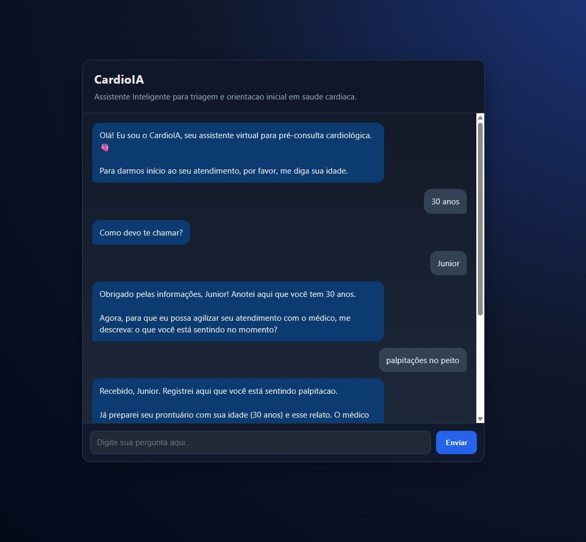
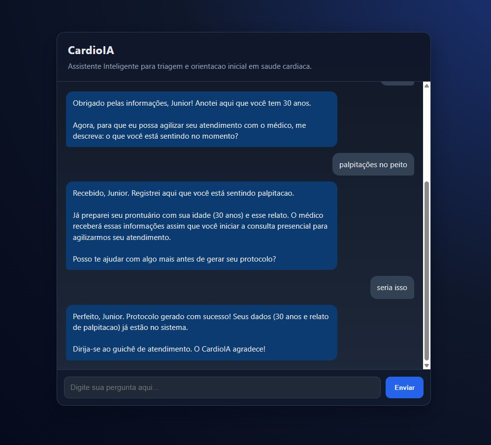
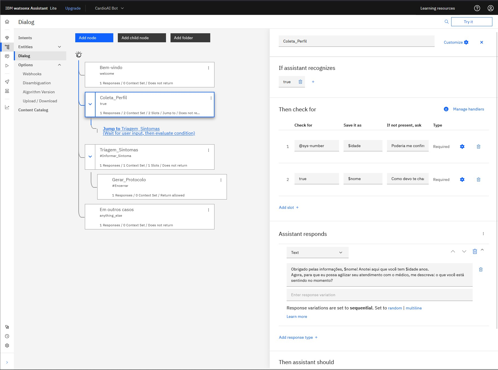

# FIAP - Faculdade de Informática e Administração Paulista

<p align="center">
<a href= "https://www.fiap.com.br/"></a>
</p>

<br>

# Nome do projeto

CardioIA - Fase 5 | Assistente Cardiologico Inteligente e Conversacional

## Nome do grupo

Grupo 11 

## 👨‍🎓 Integrantes: 
- [Ana Beatriz Duarte Domingues](https://www.linkedin.com/in/)
- [Junior Rodrigues da Silva](https://www.linkedin.com/in/jrsilva051/)
- [Carlos Emilio Castillo Estrada](https://www.linkedin.com/in/)

## 👩‍🏫 Professores:
### Tutor(a) 
- [Lucas Gomes Moreira](https://www.linkedin.com/company/inova-fusca)
### Coordenador(a)
- [André Godoi Chiovato](https://www.linkedin.com/company/inova-fusca)


## 📜 Descrição

O CardioIA e um assistente de pre-consulta cardiologica desenvolvido como prototipo academico na Fase 5. O foco desta etapa e a comunicacao inteligente com o paciente por meio de linguagem natural, utilizando IBM Watson Assistant integrado a um backend em Python (Flask).

Na pratica, o sistema simula um primeiro atendimento digital: o usuario interage por chat, informa dados basicos (como idade e nome) e relata sintomas. O assistente interpreta essas mensagens com NLP, identifica intencoes e entidades clinicas e organiza os dados de forma estruturada para apoiar o fluxo de atendimento medico.

Do ponto de vista funcional, o CardioIA:

- conduz uma conversa inicial contextualizada;
- coleta informacoes essenciais para triagem;
- identifica e registra sintomas cardiacos reportados em linguagem natural;
- gera uma resposta organizada para apoiar a continuidade do atendimento presencial.

Com isso, o projeto demonstra como agentes conversacionais podem apoiar a saude digital com foco em usabilidade, organizacao da informacao e boas praticas tecnicas.

## 🖼 Demonstrações







## 🤖 Watson Assistant (Detalhes Técnicos)

O fluxo conversacional principal foi modelado no Watson Assistant (arquivo de exportacao em [src/cardioai-bot-dialog-v1.json](src/cardioai-bot-dialog-v1.json)), com intents e slots para conduzir a triagem.

Intencoes principais:

- #Saudacao: identifica mensagens de abertura como "Oi", "Ola", "Bom dia".
- #Informar_Sintoma: identifica relatos clinicos como dor no peito, palpitacoes e falta de ar.
- #Encerrar: identifica fechamento da conversa e acionamento da geracao de protocolo.

Slots de coleta de dados:

- $nome: captura como o paciente deseja ser chamado.
- $idade: captura idade com base em @sys-number.
- $tipo_sintoma: captura o tipo de sintoma com base na entidade @SintomaCardiaco.

Exportacoes presentes no repositorio:

- [src/cardioai-bot-dialog-v1.json](src/cardioai-bot-dialog-v1.json)
- [src/cardioai-bot-action-v1.json](src/cardioai-bot-action-v1.json)
- [src/IBM-WA-5e89f777-69e0-48fc-92a5-fc12ad578a7a-V1.zip](src/IBM-WA-5e89f777-69e0-48fc-92a5-fc12ad578a7a-V1.zip)


## 📁 Estrutura de pastas

Dentre os arquivos e pastas presentes na raiz do projeto, definem-se:

- <b>app.py</b>: backend Flask principal com integracao ao IBM Watson Assistant (criacao de sessao, endpoints /welcome e /chat).

- <b>templates</b>: arquivos HTML da interface web.

- <b>static</b>: arquivos estaticos da interface.
  - <b>static/css</b>: estilos da aplicacao.
  - <b>static/js</b>: logica do chat no navegador.

- <b>document</b>: pasta para documentos da fase (relatorios, anexos e evidencias).

- <b>src</b>: artefatos de configuracao/exportacao do Watson Assistant (dialog/action/zip).

- <b>assets</b>: imagens utilizadas no README e demonstracoes visuais do projeto.

- <b>.env</b>: variaveis sensiveis de configuracao local (nao deve ser publicado).

- <b>requirements.txt</b>: dependencias Python utilizadas na aplicacao.

- <b>README.md</b>: arquivo que serve como guia e explicação geral sobre o projeto (o mesmo que você está lendo agora).

Estrutura atual (resumo):

```text
.
├── app.py
├── requirements.txt
├── README.md
├── .env
├── assets/
│   ├── logo-fiap.png
│   ├── chat_I.jpg
│   ├── chat_II.jpg
│   └── config_fluxo.jpg
├── templates/
│   └── index.html
├── static/
│   ├── css/
│   │   └── style.css
│   └── js/
│       └── script.js
├── src/
│   ├── cardioai-bot-dialog-v1.json
│   ├── cardioai-bot-action-v1.json
│   └── IBM-WA-5e89f777-69e0-48fc-92a5-fc12ad578a7a-V1.zip
└── document/
```

## 🔧 Como executar o código

Pré-requisitos:

- Python 3.10+ instalado.
- Acesso a uma instancia do IBM Watson Assistant v2.
- Terminal (PowerShell, CMD ou Bash).

Dependencias principais:

- flask
- ibm-watson
- python-dotenv
- ibm-cloud-sdk-core

Passo a passo:

1. Clone o repositorio:

```bash
git clone <URL_DO_REPOSITORIO>
cd fase5_AssistenteCardiologicoInteligente
```

2. (Opcional, recomendado) Crie e ative um ambiente virtual:

```bash
python -m venv .venv
```

Windows (PowerShell):

```powershell
.\.venv\Scripts\Activate.ps1
```

Linux/Mac:

```bash
source .venv/bin/activate
```

3. Instale as dependencias com requirements.txt:

```bash
python -m pip install -r requirements.txt
```

4. Configure o arquivo .env na raiz do projeto:

```env
API_KEY=seu_api_key_watson
SERVICE_URL=sua_service_url_watson
ENVIRONMENT_ID=seu_environment_id
ASSISTANT_ID=seu_assistant_id_opcional
WATSON_USER_ID=cardioia-web-user
```

Observacao: quando `ASSISTANT_ID` nao for informado, a aplicacao usa `ENVIRONMENT_ID` como fallback.

5. Execute a aplicacao:

```bash
python app.py
```

6. Abra no navegador:

```text
http://127.0.0.1:5000
```

## 🔒 Segurança

> **ATENCAO:** Nunca versione credenciais reais da IBM Cloud (`API_KEY`, `SERVICE_URL`, `ENVIRONMENT_ID`, `ASSISTANT_ID`).
>
> Mantenha esses dados apenas no arquivo `.env` local, inclua `.env` no `.gitignore` e, em ambientes de producao, utilize variaveis de ambiente seguras (secret manager/cofre de segredos).


## 🗃 Histórico de lançamentos

* 1.0.0 - 23/03/2026
    * Prototipo funcional do CardioIA (Fase 5) com backend Flask, integracao Watson Assistant v2 e interface web de chat.
    * Implementacao de fluxo conversacional com coleta de nome, idade e sintomas.
    * Documentacao tecnica e organizacao do repositorio.


## 📋 Licença

<p xmlns:cc="http://creativecommons.org/ns#" xmlns:dct="http://purl.org/dc/terms/"><a property="dct:title" rel="cc:attributionURL" href="https://github.com/agodoi/template">MODELO GIT FIAP</a> por <a rel="cc:attributionURL dct:creator" property="cc:attributionName" href="https://fiap.com.br">Fiap</a> está licenciado sobre <a href="http://creativecommons.org/licenses/by/4.0/?ref=chooser-v1" target="_blank" rel="license noopener noreferrer" style="display:inline-block;">Attribution 4.0 International</a>.</p>


